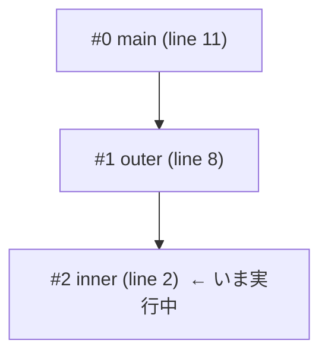

# 変数とコールスタックを覗く

前章のデバッガは、止まった場所の変数を `print` で覗けました。
しかし実際のデバッグでは、「いまいる関数」だけでなく「自分を呼んだ関数」、
さらに「それを呼んだ関数」の変数まで見たくなります。
バグの値はたいてい、いまの関数ではなく**呼び出し元から流れてきた**からです。
この章では、コールスタックをきちんと見せ、各階層の変数を覗けるようにします。

## コールスタックの正体をもう一度

第 5 章で、関数を呼ぶたびにフレームが積まれ、戻るたびに降ろされる様子を見ました。
このフレームの積み重ねが [コールスタック](#index:コールスタック) です。
たとえば `main` が `outer` を呼び、`outer` が `inner` を呼んでいる最中は、
スタックはこうなっています。



いちばん上（`#2 inner`）が、いま実行している関数です。
その下が呼び出し元、さらにその下が呼び出し元の呼び出し元……と続きます。
それぞれのフレームは、自分のローカル変数（`env`）と、自分がどの行で止まっているか（`line`）を
覚えていました。**バックトレースとは、このスタックを上から下へ読み上げるだけ**の機能です。
デバッガが新しい情報を作り出しているわけではなく、処理系がもともと持っている
コールスタックを、人間に見える形に整えて見せているだけなのです。

> [!NOTE]
> 「スタック」は「積み重ね」の意味で、最後に積んだものを最初に取り出す
> （Last In, First Out）データ構造です。お皿を積むのと同じで、いちばん上の皿から外します。
> 関数呼び出しがちょうどこの性質を持つ——最後に呼んだ関数が最初に戻る——ので、
> コールスタックという呼び名がついています。

## バックトレースに「現在地」を加える

前章の `backtrace` は、フレームを上から並べるだけでした。
これに 2 つの改良を加えます。ひとつはフレームに**番号**をつけること、
もうひとつは、いま注目しているフレームに**目印**をつけることです。
これから「注目するフレームを切り替える」機能を足すので、いまどのフレームを見ているかが
分かるようにしておきます。注目しているフレームの番号を `@selected` に持たせ、
止まるたびに最上段（いちばん内側）に初期化します。

```ruby
  def on_line(line, stmt)
    stop = @breakpoints.include?(line)
    stop ||= true if @mode == :step
    stop ||= (@frames.size <= @step_depth) if @mode == :next
    if stop
      @selected = @frames.size - 1     # 止まるたび、選択フレームを最上段に戻す
      repl(line)
    end
  end
```

バックトレースは、フレームに番号 (`#0`, `#1`, …) を振り、選択中のフレームに `*` をつけます。

```ruby
      when "backtrace", "bt"
        @frames.each_index.reverse_each do |i|
          f = @frames[i]
          mark = i == @selected ? "*" : " "
          puts "#{mark} ##{i} #{f.name} (line #{f.line})"
        end
```

`each_index.reverse_each` で、添字を大きいほう（内側）から小さいほう（外側）へたどります。
こうすると、いま実行中の関数が上に、`main` が下に表示され、直感に合います。

## 注目するフレームを移動する：up と down

デバッガの便利な機能に、**注目するフレームを上下に移動する**操作があります。
`gdb` でいう `up`（呼び出し元へ）と `down`（呼び出し先へ）です[](#cite:stallman2023)。
いまいる関数の変数を見たあと、「ひとつ外側の、呼び出し元の変数はどうなっている？」と
さかのぼれます。これは、症状から原因へさかのぼるデバッグそのものです。

実装は `@selected` を動かすだけです。`up` で外側（番号が小さいほう）へ、
`down` で内側（番号が大きいほう）へ移ります。両端を超えないように番兵をつけます。

```ruby
      when "up"
        if @selected > 0
          @selected -= 1; show_frame
        else
          puts "already at outermost"
        end
      when "down"
        if @selected < @frames.size - 1
          @selected += 1; show_frame
        else
          puts "already at innermost"
        end
```

```ruby
  def show_frame
    f = @frames[@selected]
    puts "frame ##{@selected}: #{f.name} (line #{f.line})"
  end
```

## 選択したフレームのローカル変数を一覧する

`locals` コマンドで、いま選択しているフレームのローカル変数をまとめて表示します。
フレームはローカル変数を `env`（名前→値のハッシュ）として持っているので、
それを並べるだけです。

```ruby
      when "locals"
        @frames[@selected].env.each { |k, v| puts "  #{k} = #{v}" }
```

たった 1 行ですが、これは実用デバッガの `info locals` に相当する立派な機能です。
ここでも、デバッガは処理系が持っている `env` をそのまま見せているだけだと分かります。

## いちばんの勘どころ：選んだフレームで式を評価する

`up` で呼び出し元に移ったとき、そこで `print` した式は、
**その呼び出し元のフレームの変数**を使って評価されてほしいはずです。
これをどう実現するか。前章の `print` は、つねに最上段のフレームで評価していました。

うまい方法があります。選択したフレームを、**一時的にスタックの最上段に見立てる**のです。
具体的には、評価の間だけ `@frames` を「先頭から選択フレームまで」に差し替えます。
こうすると `@frames.last`（評価器が変数を探すときに見る場所）が選択フレームになり、
評価が終わったら元のスタックに戻します。

```ruby
      when "print", "p"
        saved = @frames
        @frames = @frames[0..@selected]      # 選択フレームを一時的に最上段にする
        begin
          ast = Parser.new(tokenize(arg)).parse_expr
          puts "=> #{eval_node(ast)}"
        rescue => e
          puts "error: #{e.message}"
        ensure
          @frames = saved                    # 必ず元に戻す
        end
```

`@frames[0..@selected]` は、配列の先頭から `@selected` 番目までを取り出した新しい配列です。
これを `@frames` に入れている間、評価器から見えるコールスタックは、
ちょうど選択フレームが頂上になった状態になります。
式の中で Toy の関数を呼んでも、この差し替えたスタックの上で正しく動き、
評価が終われば `ensure` で必ず元のスタック `saved` に戻します。
`ensure` は、途中でエラーが起きても必ず実行される後始末のための構文です。

> [!IMPORTANT]
> ここは本章でいちばん大事なところです。「選んだ階の文脈で式を評価する」という、
> 一見むずかしそうな機能が、コールスタックを一時的に切り詰めるという発想だけで実現できました。
> デバッガの多くの機能は、こうした「処理系の内部状態をちょっと借りて、見方を変える」工夫の
> 積み重ねでできています。

## 動かしてみる

次の Toy プログラムで試します。`main` → `outer` → `inner` と 3 段の呼び出しが起きます。

```text
1  def inner(p) {
2    q = p * 2
3    return q
4  }
5
6  def outer(a) {
7    b = a + 100
8    return inner(b)
9  }
10
11 r = outer(5)
12 print(r)
```

2 行目（`inner` の中）にブレークポイントを置いて、そこから各階層を覗いてみましょう。

```text
(dbg) break 2
(dbg) continue
stop at line 2: q = p * 2
(dbg) backtrace
* #2 inner (line 2)      ← いま選択中（*）。実行中の関数
  #1 outer (line 8)
  #0 main (line 11)
(dbg) locals             ← inner のローカル変数
  p = 105
(dbg) up                 ← 呼び出し元 outer へ
frame #1: outer (line 8)
(dbg) locals             ← outer のローカル変数
  a = 5
  b = 105
(dbg) print a            ← 選んだフレーム(outer)の文脈で評価される
=> 5
```

`inner` から `up` で `outer` に移り、`outer` のローカル変数 `a` や `b` を覗けました。
`print a` が `5` を返したのは、評価が `outer` のフレームでおこなわれた証拠です
（`a` は `inner` には存在しません）。

さらに外側の `main` まで移ってから `outer` のフレームに戻り、
`inner` のローカル変数 `p` を見ようとすると、スコープ（変数の見える範囲）が
正しく効いていることが確認できます。

```text
(dbg) up                 ← さらに外側 main へ
frame #0: main (line 11)
(dbg) down               ← 呼び出し先 outer に戻る
frame #1: outer (line 8)
(dbg) print p            ← p は inner のローカルなので outer からは見えない
error: undefined variable: p
```

`p` は `inner` だけのものなので、`outer` のフレームからは見えず、
ちゃんと「未定義の変数」として失敗します。
各フレームが独立した `env` を持っているおかげで、変数の見える範囲が自然に分離されているのです。

> [!TIP]
> 「あるフレームから見える変数」を正しく扱えると、クロージャ（関数が定義時の環境を
> 覚えている仕組み）や、入れ子のスコープを持つ言語のデバッガへも発展させられます。
> Toy 言語はスコープが単純なので分かりやすいですが、考え方は本格的な言語でも同じです。
> このあたりを深めたい人は『計算機プログラムの構造と解釈』の環境モデルの章が
> よい道案内になります[](#cite:abelson1996)。

ここまでで、止める・進める・覗く、というデバッガの基本三点セットがそろいました。
次章では、もう一歩進んだ機能——条件付きブレークポイント、ウォッチポイント、
そして実行を巻き戻す全知デバッガ——に挑戦します。
