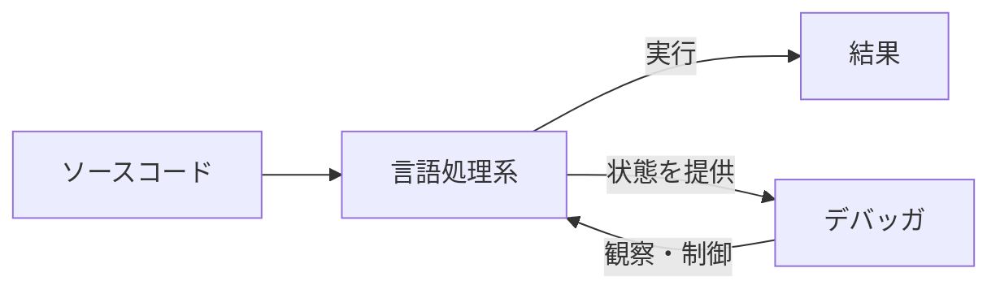

# デバッガとは何か

## バグとデバッグ

プログラムの誤りのことを [バグ](#index:バグ) (bug) と呼びます。
そしてバグを見つけて取り除く作業を [デバッグ](#index:デバッグ) (debugging) と呼びます。
「bug（虫）」という言葉が使われるようになった経緯にはいくつかの説がありますが、
1947 年に初期の計算機 Harvard Mark II の内部に本物の蛾が挟まって誤動作を起こし、
それを取り除いた記録を「first actual case of bug being found」と書き残した、
という逸話が有名です。

デバッグは、プログラミングという仕事のなかで驚くほど大きな割合を占めます。
コードを書く時間よりも、書いたコードがなぜ思いどおりに動かないのかを調べる時間のほうが
長い、という経験をした人も多いでしょう。Agans は、デバッグとは推測ではなく
観察にもとづく体系的な作業であるべきだと述べ、「**思い込みを疑え (Quit Thinking and Look)**」
という原則を強調しています。
推測で当てずっぽうに修正するのではなく、プログラムが実際に何をしているかを
「見る」ことが出発点になる、というわけです。

ここで問題になるのが、「プログラムが実際に何をしているか」を、どうやって見るのか、です。
ソースコードを眺めているだけでは、変数が実行中にどんな値を持っているのか、
どの分岐に進んだのか、どの順番で関数が呼ばれたのかは分かりません。
プログラムの**実行中の様子を観察するための道具**が必要になります。
それがデバッガです。

## デバッガの最小の定義

[デバッガ](#index:デバッガ) (debugger) とは、ひとことで言えば
**他のプログラムの実行を観察し、制御するためのプログラム** です。
ここには 2 つのキーワードがあります。

- **観察 (inspection)**: 実行中のプログラムの状態——変数の値、関数の呼び出し履歴、
  いま実行している場所など——を覗き見ること。
- **制御 (control)**: プログラムの実行を、ある地点で止めたり、1 行ずつ進めたり、
  途中から再開したりすること。

この「観察」と「制御」を組み合わせることで、私たちはプログラムを
**好きな場所で止めて、中身を調べる**ことができます。
これがデバッガの本質です。逆に言えば、ある道具がこの 2 つを提供していれば、
それはもうデバッガだと言ってよいのです。本書を通じて、
この最小の定義を実際のコードで満たしていくことになります。

> [!TIP]
> もっとも素朴なデバッガは `print` 文です。気になる場所に
> `print(x)` を仕込んで値を表示するのは、立派な「観察」です。
> これを [プリントデバッグ](#index:プリントデバッグ) と呼びます。
> 専用のデバッガは、この観察と制御を、ソースコードを書き換えずに、
> もっと自由におこなえるようにした道具だと考えるとよいでしょう。
> プリントデバッグについては「」で改めて取り上げます。

## なぜ「言語処理系」と一緒に学ぶのか

本書のタイトルには「言語処理系」という言葉がついています。
[言語処理系](#index:言語処理系) (language processor) とは、
プログラミング言語で書かれたソースコードを読み取り、それを実行する（あるいは
実行できる形に変換する）プログラムの総称です。大きく 2 種類あります。

- [インタプリタ](#index:インタプリタ) (interpreter): ソースコードを読み込んで、
  その場で直接実行していく方式。Ruby や Python の標準的な実装がこれにあたります。
- [コンパイラ](#index:コンパイラ) (compiler): ソースコードを、機械語など別の形式に
  まとめて変換しておき、あとでその変換結果を実行する方式。C や Rust がこれにあたります。

なぜデバッガを言語処理系と一緒に学ぶのでしょうか。理由は単純で、
**デバッガは言語処理系と密接に結びついている**からです。
「変数 `x` の値を見せて」と言われたとき、`x` がメモリのどこにあるのかを知っているのは、
そのプログラムを実行している処理系です。「次の 1 行だけ実行して」と言われたとき、
「1 行」がどこからどこまでなのかを知っているのも処理系です。
つまりデバッガを作るとは、**処理系が内部に持っている情報を外から取り出し、
処理系の実行を外から操作する**ことにほかなりません。

自分で言語処理系を作れば、その内部構造は手のひらの上にあります。
だからこそ、デバッガを作る練習をするには、自作の小さな処理系が最高の題材になるのです。
有名な教科書『Crafting Interpreters』も、言語を一から実装することで
言語処理系の全体像が見える、という立場をとっています。
本書はそこに「デバッガ」という切り口を加えたもの、と考えてください。

## 本書の歩き方

本書は次のような順序で進みます。

1. **デバッガの全体像をつかむ**（本章〜第 4 章）。
   デバッグという作業、デバッガが提供する機能、そしてデバッガの種類を整理します。
   ここはコードを書かずに「地図」を描く部分です。
2. **題材となる言語処理系を作る**（第 5 章）。
   Ruby で小さなインタプリタを作ります。これがデバッグの対象になります。
3. **デバッガを組み立てる**（第 6 章〜第 8 章）。
   ブレークポイント、ステップ実行、変数の検査、条件付きブレークポイントなどを
   題材の処理系に少しずつ追加していきます。
4. **現実のデバッガに橋を架ける**（第 9 章〜最終章）。
   私たちが作るおもちゃのデバッガと、`gdb` や Ruby の `debug.gem` のような
   本物のデバッガが、どこで同じでどこで違うのかを確かめます。

> [!IMPORTANT]
> 本書のサンプル言語処理系はあくまで学習用です。
> 実用的な処理系は、性能・エラー処理・対応する文法の広さなど、
> あらゆる面でずっと複雑です。しかし「デバッガを支えるしくみ」という観点では、
> 小さな処理系でも本質的な部分はちゃんと体験できます。
> Zeller も、デバッグの原理は道具の規模によらず共通だと指摘しています。

それでは、まず「デバッグという作業そのもの」をもう少し丁寧に見ていきましょう。
