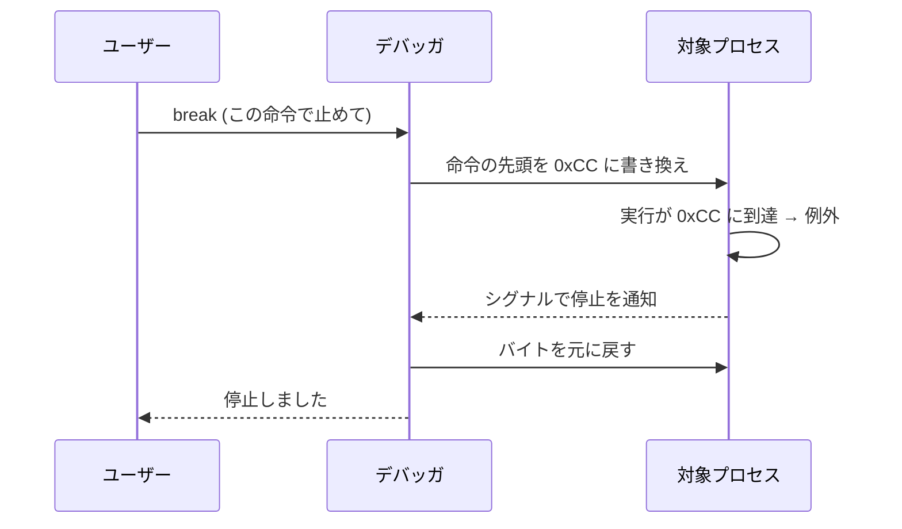
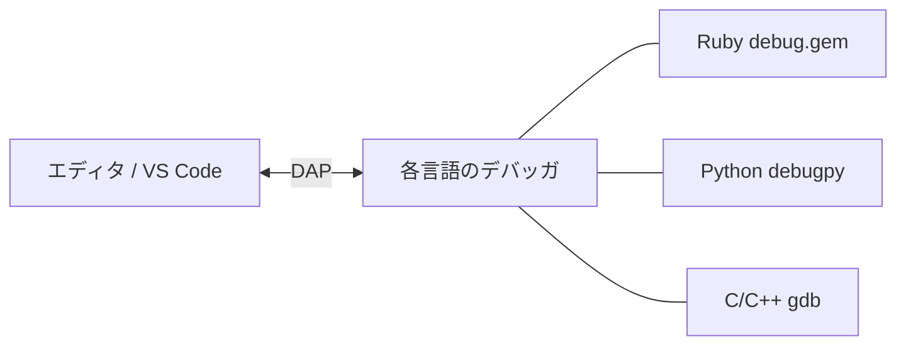

# 現実のデバッガはどう動くのか

私たちは、小さなインタプリタの中にデバッガを作りました。
では、`gdb` や `lldb`、Ruby の `debug.gem` のような本物のデバッガは、どう動いているのでしょうか。
この章では、私たちのおもちゃのデバッガを足がかりに、現実のデバッガのしくみを概観します。
細部にはとても踏み込めませんが、「考え方は地続きで、違うのは事情と工夫の量だ」と
感じてもらえれば成功です。

## 2 つの世界、ふたたび

第 4 章で、デバッガには大きく 2 つの実装方式があると述べました。
ここでもう一度、対比を明確にしておきましょう。

- **インタプリタ統合型**: 処理系の実行ループにフックを差し込む（私たちの方式、`debug.gem`）。
- **プロセス制御型**: 対象を別プロセスとして走らせ、OS の力で外から制御する（`gdb`, `lldb`）。

私たちのデバッガは前者でした。`on_line` という 1 つのフックがすべての入り口でした。
では後者は、フックを差し込めない（ソースが機械語にコンパイル済みの）プログラムを、
どうやって止め、覗くのでしょうか。

## プロセス制御型のしくみ：ptrace とソフトウェアブレークポイント

Linux でプロセス制御型デバッガを支えるのが、第 4 章で名前だけ出した
[ptrace](#index:ptrace) システムコールです。`ptrace` を使うと、デバッガ（親）は
対象プロセス（子）に対して、次のようなことができます。

- 対象を任意のタイミングで停止・再開させる。
- 対象の [レジスタ](#index:レジスタ)（CPU 内部の記憶）を読み書きする。
- 対象の [メモリ](#index:メモリ) を読み書きする。

では、機械語のプログラムに「ブレークポイント」をどう置くのでしょう。
ここに有名な仕掛けがあります。x86 という種類の CPU には、`INT3` という
「ここで止まれ」という意味の 1 バイト命令（`0xCC`）があります。
[ソフトウェアブレークポイント](#index:ソフトウェアブレークポイント) は、こう実現されます。

1. デバッガが、対象の止めたい命令の先頭 1 バイトを覚えておく。
2. その 1 バイトを `INT3`（`0xCC`）に**書き換える**。
3. 対象がそこへ実行を進めると `INT3` に当たり、CPU が例外を起こして実行が止まる。
   OS は [シグナル](#index:シグナル)（プロセスへの通知）を通じてデバッガに知らせる。
4. デバッガは、書き換えたバイトを**元に戻して**から、ユーザーと対話する。



私たちのデバッガの `on_line` での「止まるか？」のチェックと、本質は同じです。
私たちは処理系の中でソフトウェア的にチェックを挟みましたが、`gdb` は
**対象のコードを一時的に書き換える**ことで「チェックを挟む場所」を作っているのです。
目的は同じ、手段が違う——この対応が見えると、`gdb` がぐっと身近になります。

> [!NOTE]
> 前章で触れた「ハードウェアウォッチポイント」も、この延長にあります。
> 多くの CPU は「このメモリ番地に書き込みがあったら止まる」という専用レジスタ
> （デバッグレジスタ）を持っています。`gdb` はそれを使って、変数の変化を
> ソフトウェアで毎回チェックすることなく検出します[](#cite:stallman2023)。
> 私たちが第 8 章で文ごとに値を比べたのと、目的は同じです。

## ソースの言葉に翻訳する：デバッグ情報と DWARF

プロセス制御型の最大の難所は、**機械語の世界の出来事を、ソースコードの言葉に翻訳する**
ことです。CPU が止まったのはメモリ番地 `0x4011a3`。でもユーザーが知りたいのは
「`main.c` の 42 行目」です。レジスタには `0x6f` が入っている。でもユーザーが知りたいのは
「変数 `count` は `111`」です。この翻訳を可能にするのが、第 4 章で触れた
[デバッグ情報](#index:デバッグ情報) であり、その標準形式が [DWARF](#index:DWARF) でした[](#cite:dwarf2017)。

コンパイラは（デバッグ用のオプションをつけて翻訳すると）機械語と一緒に、
おおよそ次のような対応表を出力します。

- **行番号表**: 「この機械語の番地は、ソースの何行目に対応するか」。
  私たちの処理系で `[:stmt, 行番号, ...]` が持っていた行番号情報に相当します。
- **変数の位置情報**: 「変数 `count` は、いまレジスタ何番、あるいはスタックのどこにあるか」。
  私たちの `Frame` の `env`（名前→値の表）に相当します。
- **型情報・スコープ情報**: その変数がどんな型で、どの範囲で有効か。

つまり DWARF は、私たちが処理系の中に**最初から持っていた情報**——行番号や変数表——を、
コンパイル済みのプログラムのために**外付けの表として用意したもの**だと言えます。
自作インタプリタでデバッガが簡単に作れたのは、この情報がそもそも手元にあったからなのです。
ドラゴンブックが説く、コンパイラがソースから取り出すさまざまな情報[](#cite:aho2006) が、
デバッグ情報という形で実行後の世界まで運ばれてくる、と考えると見通しがよくなります。

> [!TIP]
> 「リリースビルドだと変数の値が `<optimized out>` と表示されて見えない」という経験は、
> ここに理由があります。最適化されたコードでは、変数がレジスタに置かれたり消えたりして、
> ソースの変数と機械語の対応が崩れます。すると DWARF でも位置を表せず、デバッガはお手上げに
> なります。観察と最適化は、しばしば緊張関係にあるのです。

## Ruby のデバッガ：私たちの方式の本格版

Ruby の `debug.gem` は、私たちと同じインタプリタ統合型です[](#cite:rubydebug)。
ですから、考え方はこの本で作ったものとよく似ています。
違いは、Ruby インタプリタという巨大で本格的な処理系の上に作られている点です。

その中核にあるのが [TracePoint](#index:TracePoint) という仕組みです。
これは、Ruby インタプリタが実行中に起こすイベント——「行を実行した」
「メソッドを呼んだ」「メソッドから戻った」「例外が起きた」など——を、
横から受け取るための公式の窓口です。私たちが `exec_stmt` に手で開けた `on_line` フックを、
Ruby はインタプリタの機能として標準で提供している、と考えてください。
実際に動かしてみましょう。

```ruby
tp = TracePoint.new(:line) do |t|       # 「行の実行」イベントを受け取る
  puts "line #{t.lineno}: #{t.event}"
end

tp.enable do
  x = 1 + 2
  y = x * 3
  z = x + y
end
```

これを実行すると、ブロック内の各行が実行されるたびにイベントが届きます。

```text
line 6: line
line 7: line
line 8: line
```

`x = 1 + 2`、`y = x * 3`、`z = x + y` の 3 行それぞれで、`:line` イベントが発生しました。
これはまさに、私たちの `on_line(line, stmt)` が文ごとに呼ばれたのと同じことです。
`debug.gem` は、この `:line` イベントでブレークポイントの判定をし、`:call` / `:return` イベントで
ステップオーバーの深さを管理し……というように、本書で作った機能を `TracePoint` の上に
組み上げています[](#cite:sasada2021)。

> [!IMPORTANT]
> ここが本書のハイライトです。あなたが第 6 章で書いた `on_line` フックは、
> Ruby の `TracePoint` の `:line` イベントと、発想がそっくりそのままです。
> おもちゃのデバッガで体験した「文の切れ目で呼ばれるフックがデバッガの入り口になる」
> という原理は、本物の Ruby デバッガでもまったく同じように働いているのです。

## デバッガとエディタをつなぐ：DAP

最後に、現代のデバッガに欠かせない要素として [DAP](#index:DAP) (Debug Adapter Protocol) に
触れておきます。第 4 章でも紹介したとおり、これはデバッガ本体と、エディタなどの
操作画面（フロントエンド）との間の通信を標準化した規約です。

DAP の発想は、本書の設計と響き合います。私たちのデバッガでも、
「止まるか判断し状態を持つ部分（`on_line` と `Interpreter`）」と
「ユーザーと対話する部分（`repl`）」は、役割がはっきり分かれていました。
DAP はこの境界を、ネットワーク越しの標準プロトコルにまで一般化したものです。
おかげで、ひとつのエディタ（VS Code など）から、Ruby・Python・C++ など
さまざまな言語のデバッガを、同じ操作感で扱えます。
`debug.gem` も DAP に対応し、エディタ連携やリモートデバッグを実現しています[](#cite:rubydebug)。



## まとめ：地続きの世界

この章で見てきたことを、私たちのおもちゃのデバッガとの対応で整理します。

| 私たちが作ったもの | 現実のデバッガでの対応 |
|--------------------|------------------------|
| `on_line` フック | `TracePoint` の `:line` イベント / `INT3` によるトラップ |
| `[:stmt, 行番号, ...]` の行番号 | DWARF の行番号表 |
| `Frame#env`（変数表） | DWARF の変数位置情報 / 処理系内部の局所変数表 |
| `@frames`（コールスタック） | 実行中スタックの巻き戻し（スタックアンワインド） |
| 文ごとの値の比較（ウォッチ） | CPU のデバッグレジスタ（ハードウェアウォッチポイント） |
| `repl` と内部状態の分離 | DAP によるフロントエンドとデバッガの分離 |

仕組みの規模はまるで違いますが、**「実行を止め、状態を読み、操作する」という骨格は同じ**です。
あなたはもう、その骨格を自分の手で組み立てました。
だからこそ、これらの本物のデバッガの解説も、これからは「知らない魔法」ではなく
「規模の大きな同じ仕事」として読めるはずです。

最終章では、本書全体を振り返り、ここから先に進むための道しるべを示します。
